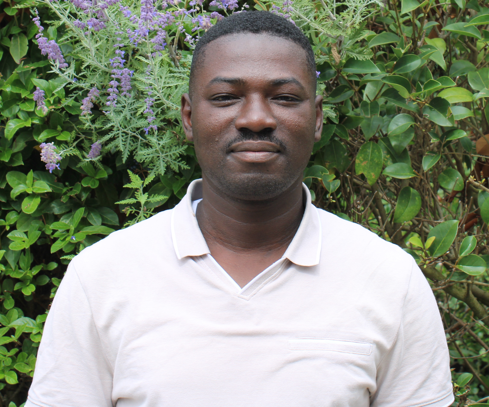

<!-- LEFT COLUMN -->

<aside class="sidebar">
  

<h1 class="name">Essoham Ali</h1>

Lecturer–Researcher in Statistics

Institute of Applied Mathematics (MAI) UCO Angers

Member of LMBA, Université Bretagne Sud

📧 <a href="mailto:essoham.ali@univ-ubs.fr">
essoham.ali@univ-ubs.fr
</a>

<h3>Links : </h3>

<a href="https://scholar.google.com/citations?user=eUeEmdAAAAAJ&hl=fr">Google Scholar</a> 
<a href="/assets/cv-essoham_ali.pdf">Curriculum Vitae</a>

</aside>

<!-- RIGHT COLUMN -->

<main class="content">

<h1>Research Profile</h1>

My research focuses on statistical methodology for complex data, with particular emphasis on the modeling and analysis of count data, including zero-inflated, mixture, and multivariate count models.

I also work on high-dimensional statistical inference and regularization methods, such as ridge-type estimators, penalized likelihood approaches, and variable selection techniques. Another line of my research concerns robust statistical methods and influence diagnostics, including robust estimation, doubly robust procedures, and the detection of influential observations.

I am also interested in dimension reduction and semiparametric regression models, particularly single-index models and sparse gradient-based methods. More broadly, my work involves computational statistics, including likelihood-based inference, EM-type algorithms, and numerical methods for estimating complex statistical models.

<h2>Research Interests</h2>

<ul>
<li>Count data modeling</li>
<li>Multivariate count models</li>
<li>High-dimensional inference</li>
<li>Regularization methods</li>
<li>Robust statistics</li>
<li>Single-index models</li>
<li>Sparse gradient-based methods</li>
<li>Computational statistics</li>
</ul>
</main>

<!-- SOFTWARE SECTION FULL WIDTH -->

<section class="software-section">

<h2>Software & Code</h2>

<a href="/R-analysis/index.html" class="software-card">

<h3>R</h3>

Statistical software and reproducible research

</a>

<a href="https://github.com/essohali/python-project" class="software-card">

<h3>Python</h3>

Statistical computing and machine learning

</a>

<a href="https://avril1989.shinyapps.io/shiny/" class="software-card">

<h3>Shiny Apps</h3>

Interactive statistical applications

</a>

<a href="https://github.com/essohali" class="software-card">

<h3>GitHub</h3>

Research code and open-source projects

</a>

</section>

